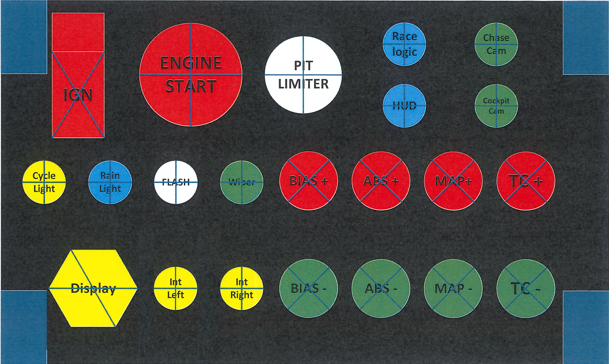

# PS5-ACC-Button-Box

Creating a Button Box to be used on a PS5 for Assetto Corsa Competizione.

This will use a Raspberry Pi Pico 2 with switches and buttons from Aliexpress.

Configuring the Pico to use the ACC Keyboard Shortcuts that are described here https://solox.gg/acc-keyboard-shortcuts/

Code based on https://learn.adafruit.com/diy-pico-mechanical-keyboard-with-fritzing-circuitpython

## Parts List

<ul>
  <li>12mm Push Buttons - https://vi.aliexpress.com/item/1005004556149934.html</li>
  <li>Junction Box - 200x120x56mm - https://vi.aliexpress.com/item/1005005367221276.html</li>
  <li>3 Position Rotary Switch - https://vi.aliexpress.com/item/1005007167641825.html</li>
  <li>19mm Flat push Button Switch - https://vi.aliexpress.com/item/1005004765834557.html</li>
  <li>16mm Push Buttons - https://vi.aliexpress.com/item/1005005906389808.html</li>
  <li>Toggle Switch with Cover - https://vi.aliexpress.com/item/1005004068738380.html</li>
  <li>Momentary Toggle Switch - https://vi.aliexpress.com/item/1005004367116021.html</li>
  <li>Jumper Cable - https://vi.aliexpress.com/item/4000943168064.html</li>
  <li>Mounting Bracket - https://vi.aliexpress.com/item/1005007642026372.html</li>
</ul>

## Install the prerequisites and the code

Use this guide https://learn.adafruit.com/diy-pico-mechanical-keyboard-with-fritzing-circuitpython to be able to load the requirements and the code. 

Quick Guide
<ol>
  <li>Install CircuitPython onto the Pico</li>
      <ol>
        <li>Download the correct .UF2 circuitpython file. These are located either at https://circuitpython.org/board/raspberry_pi_pico/ or https://circuitpython.org/board/raspberry_pi_pico2/ depending on the version of Pico you have</li>
        <li>Copy the .UF2 file onto the mounted drive</li>
        <li>The Pico will automatically reboot and install circuit python</li></li>
      </ol>
  <li>Install the Adafruit HID Library
    <ol>
      <li>Copy the lib folder to the root directory of the Pico</li>
    </ol>
  </li>
  <li>Copy code.py to the root directory of the Pico</li>
  <li>The Pico is ready</li>
</ol>

## Mounting Switches

Here is the picture of the button layout.

Firstly print the picture and tape it to the front of the box to get the correct mounting locations. Then using the guidelines drill the pilot holes in all the switch locations.

Using a step-down drillbit, drill all the holes out to the correct sizes for the buttons

Next mount all the switches onto the box. Note that the Left Int and Display buttons have been slightly shifted to line up on the box with the other buttons.

## Wire up the Switches to the Pico

The plan to wire all the switches to the Pico.

[Wiring Document](https://github.com/parriehunter/PS5-ACC-Button-Box/blob/80056785973887c2171809795dea002bc850069e/assets/doc/ButtonBox.Mappings.pdf)

Starting with the GND wires, these are wired to the bottom of every button and then joined to a GND pad on the Pico

The other side of the buttons are then wired to the correct GPIO pins on the Pico as per the wiring drawing and mappings document

## Mount the Button Box to the Sim Rig
This small TV mounting bracket has been used to mount the button box to my Sim. https://vi.aliexpress.com/item/1005007642026372.html

Here it is beside my T300RS

##Thanks

Thanks for viewing this little project. After a few more hours in ACC it has changed the game for me to be able to change things while in race so much more easily.
